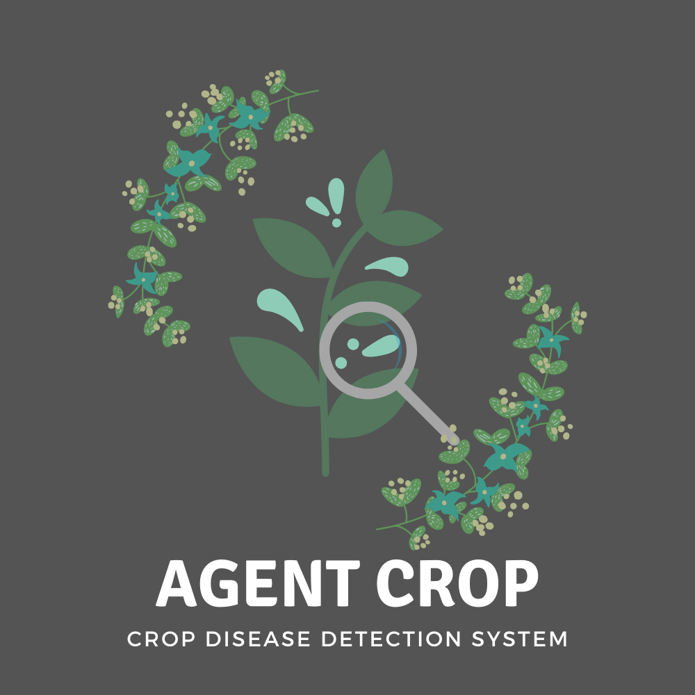

<div align="center">
  
</div>

# Agent-Crop
Agent Crop is a Crop Disease detection and Cure suggestion system. It also provides details about the symptoms and the description of the particular disease.  
- The link for the Pre-Trained Model can be found in the [app.py](./app.py) file.
- The API can be accessed at the endpoint: https://agentcrop.azurewebsites.net/api/predict  
- The API request should have 'files' part and should only include png and jpg/jpeg files of size less than 50 MB.
<br>  

## Setup Environment and Run App Locally

### Note: Make sure, you have Python 3 installed. 

1. Download the Code. Open the folder.
2. Now, open Terminal/Powershell there. Create and activate virtual environment for python, using below commands:  

In Windows Powershell:
```
> python -m venv venv
> Set-ExecutionPolicy Unrestricted -Scope Process
> venv\scripts\activate
```
`Set-ExecutionPolicy` command will give unrestricted aceess to current process, so it will let you run activate script.   

Or In Linux/Mac:
```
$ python3 -m venv venv
$ . venv/bin/activate
```
3. Now, install requirements with this command:
```
> pip install -r requirements.txt
```
4. Now run the application using below command:
```
> flask run
```
After running, You can access this app on http://127.0.0.1:5000  
<br>  
<details>
<summary>Implement API in your App</summary>

```html
<!DOCTYPE html>
<html>
    <body>
        <form action="https://agentcrop.azurewebsites.net/api/predict" method = "POST" enctype = "multipart/form-data" id="api-form">
            <input type="file" name="files" multiple required />
            <input type="submit" value="submit" />
        </form>
        <div id="show-data"></div>
        <script>
            // Function to work with your data.
            function workWithData(data) {

                // Here you can simply show data using iterating through it or you can do whatever you want with it.
                document.getElementById('show-data').innerHTML = "";
                for (let imageName in data) {
                    document.getElementById('show-data').innerHTML += "<h3>" + imageName + ": </h3>";
                    for (let detail in data[imageName]) {
                        document.getElementById('show-data').innerHTML += "<p><strong>" + detail.replace(detail[0], detail[0].toUpperCase()) + ": </strong>" + data[imageName][detail] + "</p>";
                    }
                }
            }

            // Function to handle submit event.
            function handleFormSubmit(event) {
                
                // Prevent default behavior of submit event.
                event.preventDefault();

                // Get the form element and url.
                const form = event.currentTarget;
                const url = form.action;
                
                // Define formData object to store the images and later send it to API.
                const formData = new FormData();

                // Find file input element.
                const photos = document.querySelector('input[type="file"][multiple]');
                
                // Iterate through file input element and save images to the formData object.
                for (let i = 0; i < photos.files.length; i++) {
                    formData.append('files', photos.files[i]);
                }

                // Below we use fetch to send formData to the API.
                fetch(url, {
                    method: 'POST',
                    body: formData,
                    origin: "*"
                })
                .then(
                    // After that we get response and work with it.
                    function(response) {

                        // If response's ok property is false, then shows error and return.
                        if (!response.ok) {
                            console.log('Looks like there was a problem. Status Code: ' + response.status);
                            return;
                        }

                        // Now we parse response to the json and then get the data object.
                        response.json().then(function(data) {

                            // We will pass data object to external function to work with it.
                            workWithData(data);
                        });
                    }
                )
                .catch(function(err) {
                    
                    // If any error occurs the it will show it.
                    console.log('Fetch Error :-S', err);
                });
            }

            // Get the form element using it's id.
            const apiForm = document.getElementById("api-form");

            // Add event listener on submit event.
            apiForm.addEventListener("submit", handleFormSubmit);
        </script>
    </body>
</html>
```

The API returns the json response in the following format:

```json
{
    "image_1": {
        "description": "description_1",
        "prediction": "prediction_1",
        "source": "source_link_1",
        "symptoms": "symptoms_1"
    },
    "image_2": {
        "description": "description_2",
        "prediction": "prediction_2",
        "source": "source_link_2",
        "symptoms": "symptoms_2"
    }
}
```

</details>

<details>
<summary>List of Crops and Diseases supported</summary>

- Apple
  - Apple Scab
  - Black Rot
  - Cedar Rust
  - Healthy
- Blueberry
  - Healthy
- Cherry
  - Powdery Mildew
  - Healthy
- Corn (Maize)
  - Grey Leaf Spot
  - Common Rust of Maize
  - Northern Leaf Blight
  - Healthy
- Grape
  - Black Rot
  - Black Measles (Esca)
  - Leaf Blight (Isariopsis Leaf Spot)
  - healthy
- Orange
  - Huanglongbing (Citrus Greening)
- Peach
  - Bacterial spot
  - healthy
- Bell Pepper
  - Bacterial Spot
  - Healthy
- Potato
  - Early Blight
  - Late Blight
  - Healthy
- Raspberry
  - Healthy
- Rice
  - Brown Spot
  - Hispa
  - Leaf Blast
  - Healthy
- Soybean
  - Healthy
- Squash
  - Powdery Mildew
- Strawberry
  - Leaf Scorch
  - Healthy
- Tomato
  - Bacterial Spot
  - Early Blight
  - Late Blight
  - Leaf Mold
  - Septoria Leaf Spot
  - Spider Mites (Two-spotted Spider Mite)
  - Target Spot
  - Yellow Leaf Curl Virus
  - Mosaic Virus
  - Healthy

</details>
